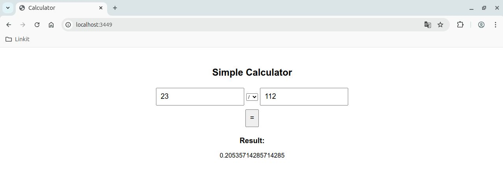

# 🧮 ClojureScript Calculator

A simple web-based calculator built with [ClojureScript](https://clojurescript.org/), [Reagent](https://reagent-project.github.io/), and [Figwheel](https://figwheel.org/).



## 🚀 Features

- Input two numbers and select an operation
- Supports addition, subtraction, multiplication, and division
- Realtime UI updates using Reagent (React wrapper for ClojureScript)
- Hot-reloading with Figwheel

---

## 🛠️ Getting Started

### Prerequisites

- [Leiningen](https://leiningen.org/) installed
- Java 8 or newer
- Git (optional, for cloning)

### Clone and run

```bash
git clone https://github.com/yourusername/clojurescript-calculator.git
cd clojurescript-calculator
lein figwheel
```
Then open your browser at:
```bash
http://localhost:3449
```
## 📁 Project Structure
```bash
calculator/
├── project.clj              ;; Leiningen config
├── src/
│   └── calculator/
│       └── core.cljs        ;; Main app logic
├── resources/public/
│   ├── index.html           ;; Entry HTML
│   └── js/
│       └── main.js          ;; Output compiled JS
```
## 🔄 Development Workflow

While Figwheel is running:

- Edit src/calculator/core.cljs
- Changes are automatically recompiled and hot-loaded into the browser
- Logs appear in the terminal and browser console

To exit, press Ctrl+D in the terminal.

## 📦 Production Build

To compile for production:

```bash
lein cljsbuild once min
```
Then serve the files in resources/public.

## 🧠 Tech Stack

- **ClojureScript** – Functional frontend programming
- **Reagent** – ClojureScript wrapper for React
- **Figwheel** – Live reloading development server
