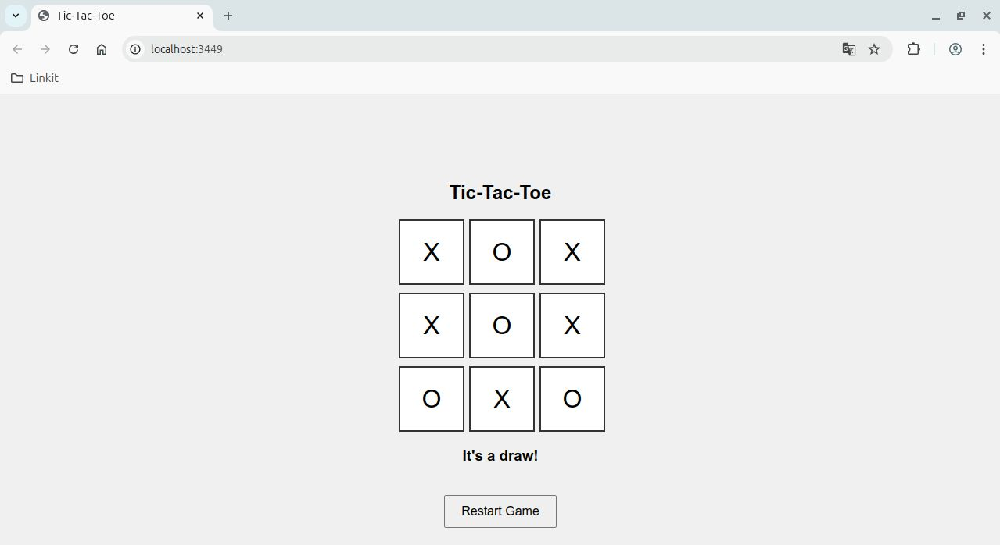
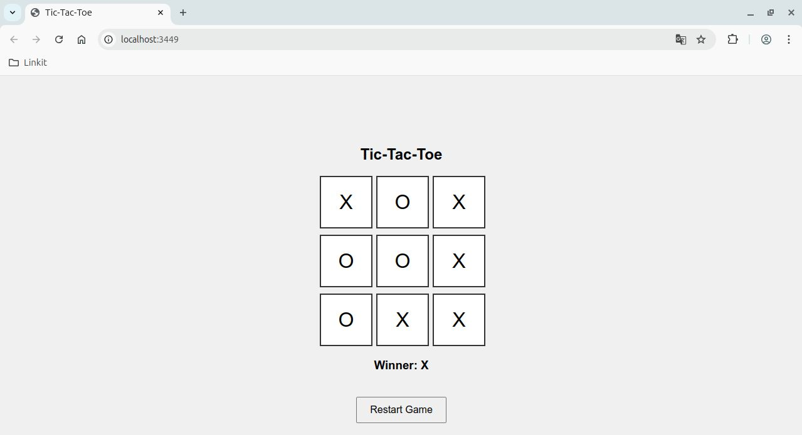

# 🧮 Tic-Tac-Toe in ClojureScript

A simple Tic-Tac-Toe game built using [ClojureScript](https://clojurescript.org/) and [Reagent](https://reagent-project.github.io/), with hot reloading via [Figwheel](https://figwheel.org/).




## 🚀 Features

- Built with functional ClojureScript
- Uses Reagent for a reactive UI
- Figwheel for live reloading during development
- Simple CSS styling for a clean interface
- Reset button to restart the game
- Displays current player and winner

---

## 📦 Project Setup

### Prerequisites

- [Leiningen](https://leiningen.org/) installed
- Java 8+ installed

### Running the App

```bash
lein figwheel
```
Then open your browser and go to:
```bash
http://localhost:3449
```
## 📁 Directory Structure
```bash
.
├── project.clj                  ; Project config
├── src/tictactoe/core.cljs     ; Main game logic
├── resources/public/
│   ├── index.html              ; HTML shell
│   ├── css/style.css           ; Styling
│   └── js/                     ; Compiled JS output
```
## 🎮 How to Play

- Click on a square to make a move
- Players alternate between **X** and **O**
- The winner is shown when three in a row is achieved
- Click **"Restart Game"** to play again

## 📚 Tech Stack

- **Language** – ClojureScript
- **UI Library** – Reagent
- **Build Tools** – Leiningen, Figwheel
